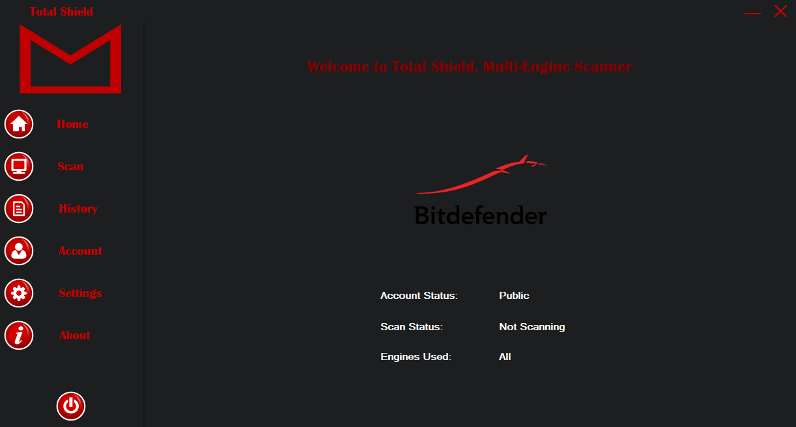
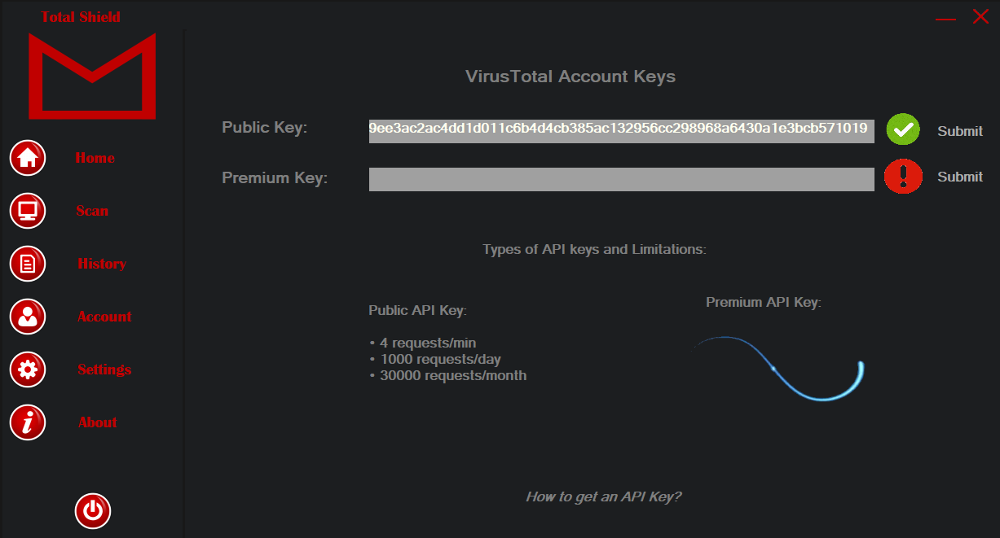
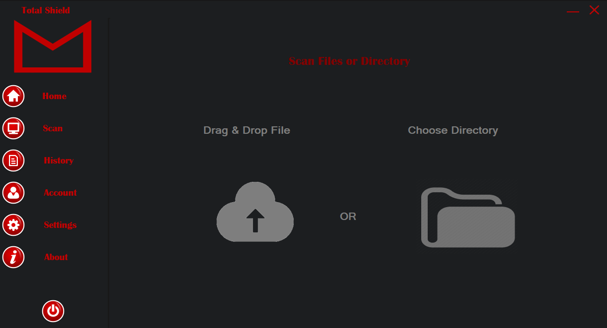
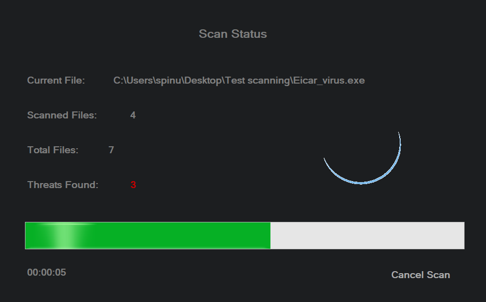
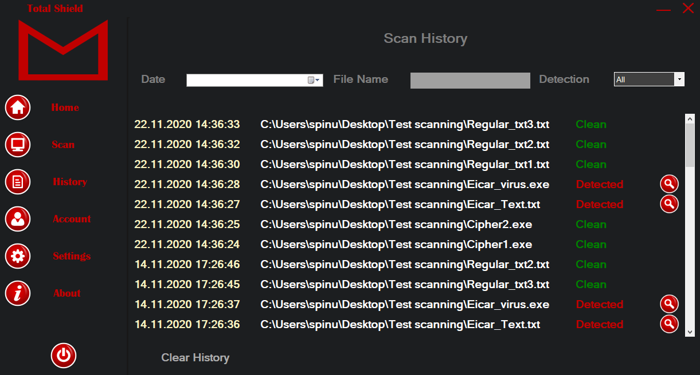
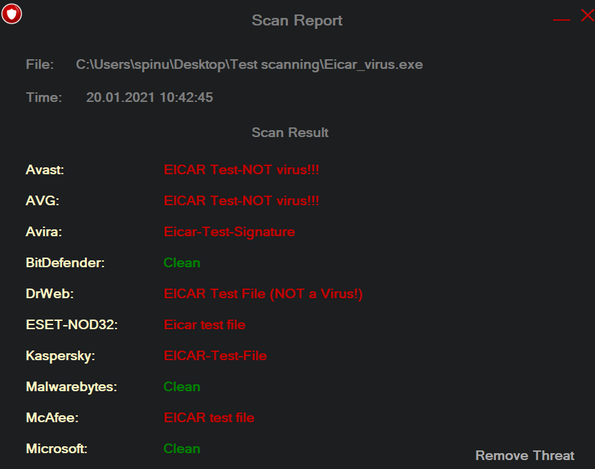
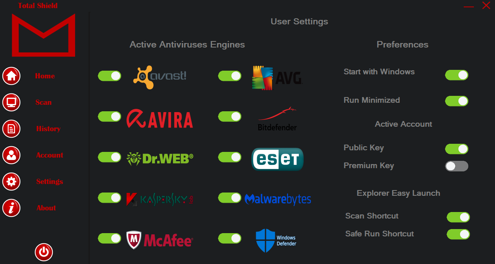
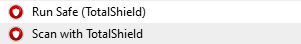
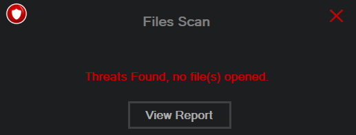

# TotalShield
  This App usses the engines of 10 top antivirusses to scan your files. There is also an installer in the \TotalShield-master\TotalShield\TotalShieldSetup\bin\Release directory.
Also the build directory is in the TotalShieldSetup\Resources\ path.
  
  Please notice that this is not a commercial and official anti-virus solution and it might be detected as a threat by your current anti malware solution so you might have to add it in the White list in order to run it.
  
  Below you can see the Home page of the TotalShield app. It includes a short gif will all the antivirus engines' logos used to scan for threats and also contains a few information about current scan status if there is any scan running at the momment, the account status and information about the engines used for scanning selected by the user in the settings menu.

Once the app is installed with the installer, first the user have to go in the Account menu to set his key. On mouse hover of the "How to get an API Key?" label the user will see a little guide on how to get his key.

Once the key is set, in the scan menu the user can initiate a scan choosing either a directory or by the drag and drop function.

Once the file are selected, the user will be provided dinamycally with information regarding his scan status.

The user also has the posibility to view his previous scans in the History menu. Also a few sorting filters can help the user filter his previous scans by his preferences.

By clicking the magnifier icon the user will see a short information based on each antivirus engine scan result.

There is also a Settings menu where the user can select the antivirus engines used for scans and a few preferences, including the option to start with Windows with the property to run minimized either not, the option to select the key used for scans and the "Explorer Easy Launch" option which include two context menu functions

The "Explorer Easy Launch" function will display 2 options in the context menu: "RunSafe (TotalShield)" and "Scan with TotalShield".

The Scan with TotalShield will run a regular scan, while "RunSafe (TotalShield)" function will initiate a scan in the background and if the file is Clean it will run immediatly, but if it is not it will not run and the user will get an notification in the lower right corner.

